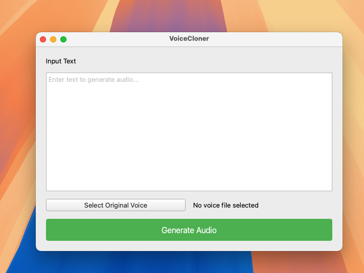

# VoiceCloner

Voice cloning and text-to-speech with multiple TTS engines. Clone any voice from a short audio sample and generate speech in that voice.



## Features

- **Voice Cloning** - Clone voices from 5-30 second audio samples
- **Multiple Engines** - Coqui XTTS v2 (multilingual) and Chatterbox (fast/expressive)
- **16 Languages** - English, Spanish, French, German, Chinese, Japanese, and more
- **Three Interfaces** - GUI application, CLI tool, and Python API
- **Expressive Speech** - Paralinguistic tags for laughs, sighs, gasps (Chatterbox Turbo)

## Quick Start

### Installation

```bash
# Clone repository
git clone https://github.com/luongnv89/voice-cloner.git
cd voice-cloner

# Create virtual environment
python3.10 -m venv .venv
source .venv/bin/activate  # Windows: .venv\Scripts\activate

# Install dependencies
pip install -e .

# Optional: Chatterbox engine
pip install -e ".[chatterbox]"
```

### Usage

**GUI Application:**
```bash
python voice_cloning_app.py
```

**Command Line:**
```bash
python vcloner.py -i voice.wav -t "Hello world" -o output.wav
```

**Python API:**
```python
from voice_cloner import VoiceCloner

cloner = VoiceCloner(speaker_wav="./voice-samples/speaker.wav")
cloner.say("Hello, this is my cloned voice!", save_audio=True, output_file="output.wav")
```

## TTS Engines

| Engine | Languages | Speed | Best For |
|--------|-----------|-------|----------|
| **Coqui XTTS v2** | 16 | Medium | Multilingual, quality |
| **Chatterbox Turbo** | English | Fast | Rapid iteration, expressions |
| **Chatterbox Standard** | English | Medium | Production quality |

**Expressive speech with Chatterbox Turbo:**
```python
cloner.say("That's hilarious [laugh]! I can't believe it [gasp]!")
```

Tags: `[laugh]`, `[chuckle]`, `[cough]`, `[sigh]`, `[gasp]`, `[yawn]`

## Documentation

| Document | Description |
|----------|-------------|
| [API Reference](docs/api-reference.md) | Complete Python API documentation |
| [CLI Reference](docs/cli-reference.md) | Command-line interface guide |
| [GUI Guide](docs/gui-guide.md) | Desktop application user manual |
| [Engines Guide](docs/engines.md) | TTS engine comparison and parameters |
| [Architecture](docs/architecture.md) | System design and patterns |
| [Development](docs/development.md) | Contributing and setup guide |
| [Troubleshooting](docs/troubleshooting.md) | Common issues and solutions |

## System Requirements

- Python 3.10+
- 8GB RAM (16GB recommended)
- NVIDIA GPU with CUDA (optional, for faster processing)

## License

MIT License - see [LICENSE](LICENSE) file.

## Acknowledgments

- [Coqui TTS](https://github.com/coqui-ai/TTS) - XTTS v2 model
- [Chatterbox](https://github.com/resemble-ai/chatterbox) - Fast TTS by Resemble AI
- [PyTorch](https://pytorch.org/) - Deep learning framework
