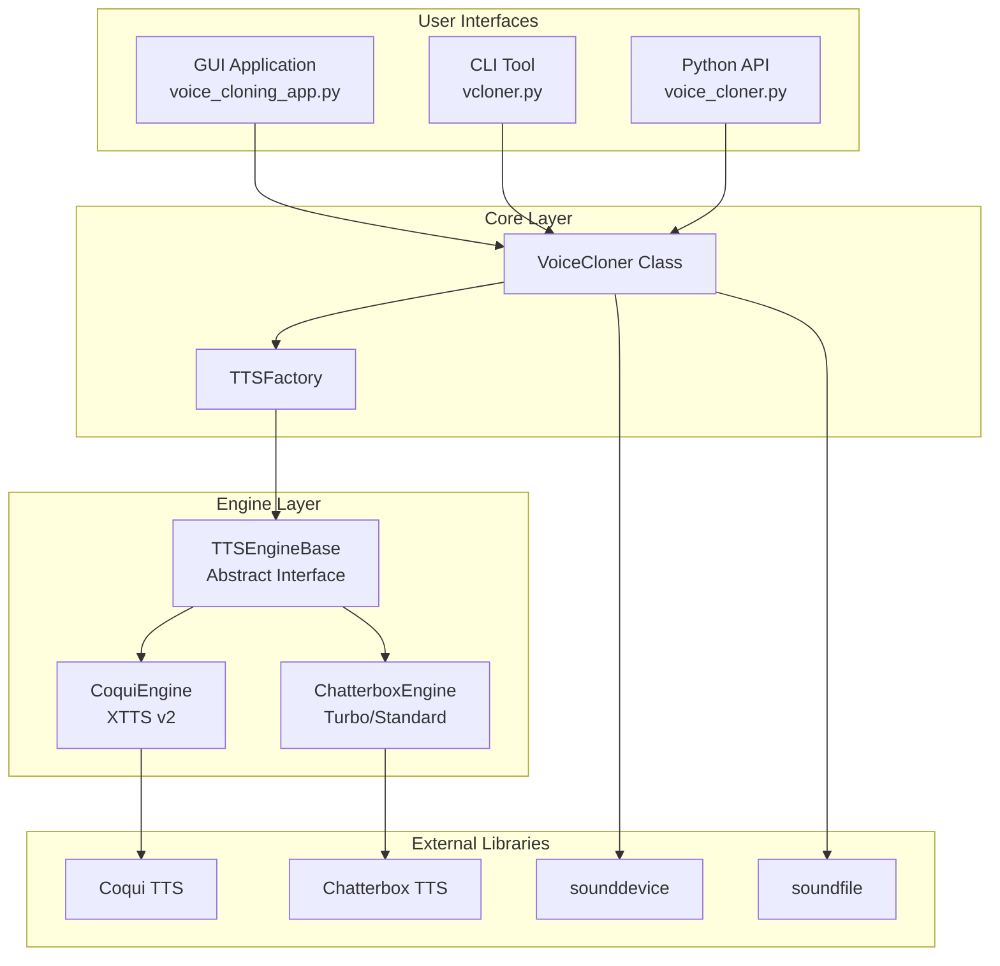
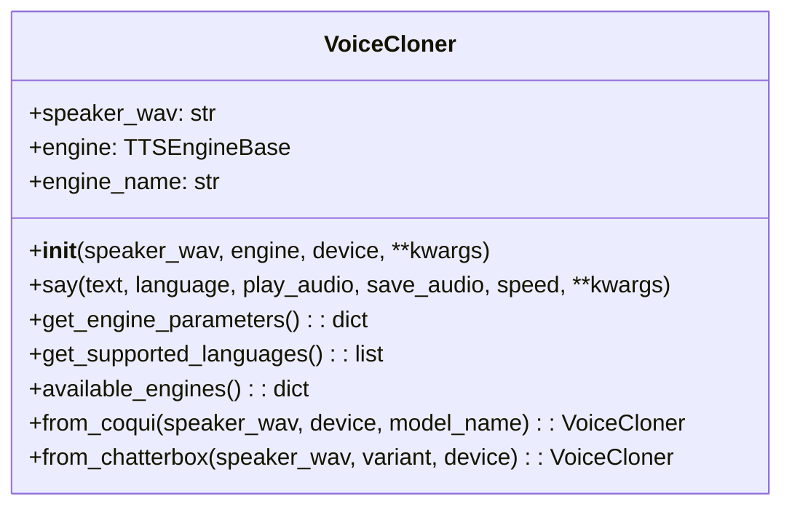
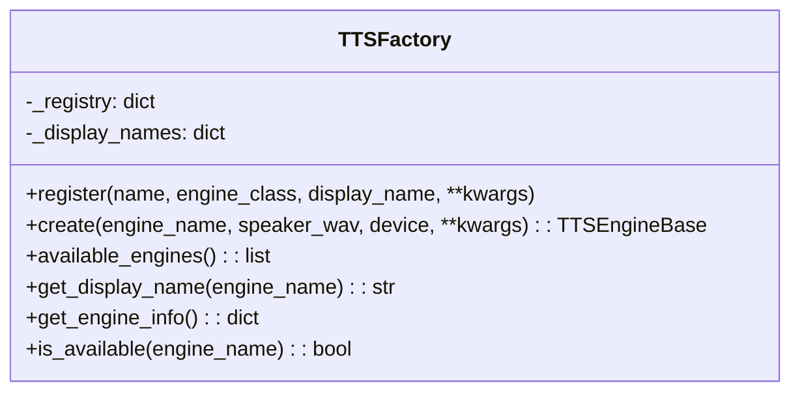
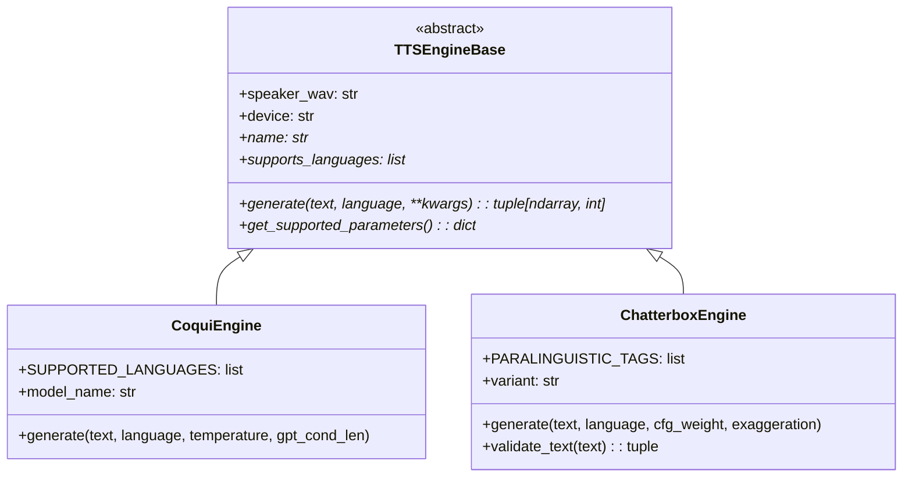
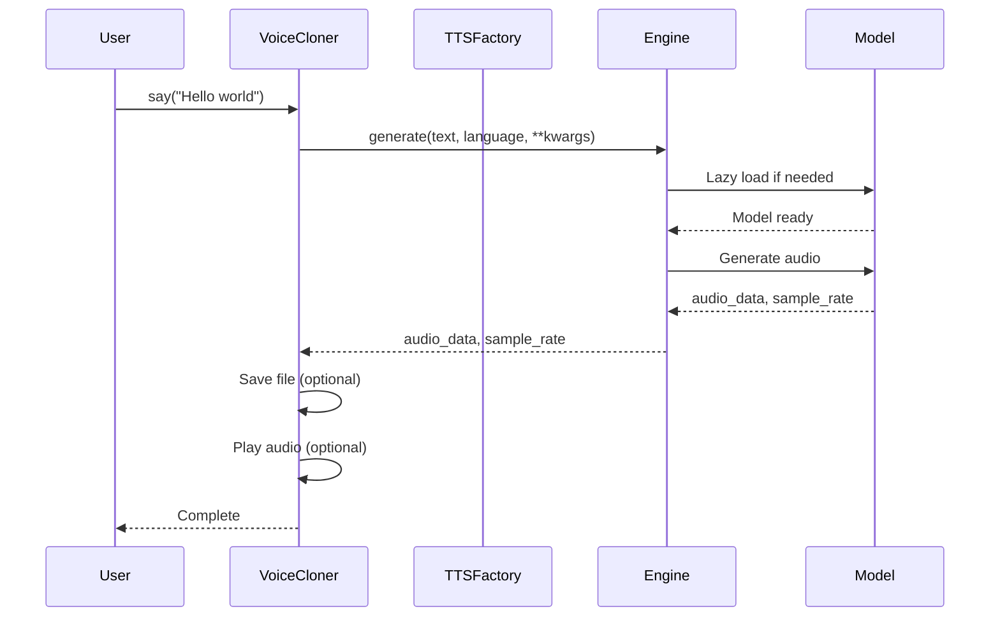
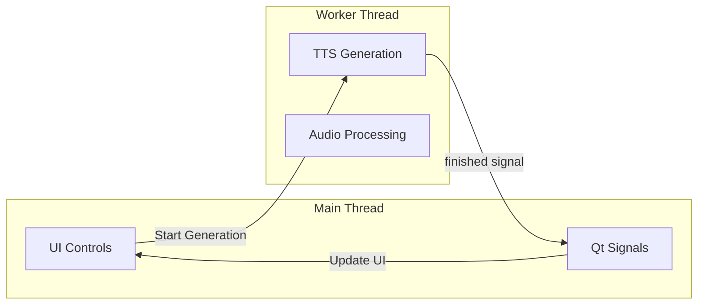

# Architecture

This document describes the architecture and design patterns used in VoiceCloner.

## Overview

VoiceCloner follows a layered architecture with clear separation of concerns:



## Components

### User Interface Layer

#### GUI Application (`voice_cloning_app.py`)
- Built with PySide6 (Qt bindings)
- Non-blocking TTS generation using `QThread`
- Dynamic engine-specific controls via `gui/engine_controls.py`
- Features: voice file selection, text input, playback, and save

#### CLI Tool (`vcloner.py`)
- Argument parsing with `argparse`
- Rich console output for enhanced terminal UX
- Supports all engine-specific parameters
- Engine listing with availability status

#### Python API (`voice_cloner.py`)
- Primary programmatic interface
- Factory methods: `from_coqui()`, `from_chatterbox()`
- Audio playback and file saving built-in

### Core Layer

#### VoiceCloner Class

The main entry point for all TTS operations:



#### TTSFactory

Factory pattern for engine instantiation:



### Engine Layer

#### TTSEngineBase (Abstract)

Defines the interface all TTS engines must implement:



## Design Patterns

### Factory Pattern

The `TTSFactory` class implements the Factory pattern for engine creation:

- **Registration**: Engines self-register on module import
- **Creation**: Factory creates appropriate engine based on name
- **Extensibility**: New engines can be added without modifying core code

### Template Method Pattern

`TTSEngineBase` defines the template for TTS operations:

- Abstract methods define what subclasses must implement
- Common functionality (device detection) in base class
- Subclasses customize generation logic

### Lazy Loading

Both engines use lazy model loading:

```python
@property
def model(self):
    if self._model is None:
        # Load heavy model only when first needed
        self._model = load_model()
    return self._model
```

This reduces startup time and memory usage when engines aren't used.

## Data Flow

### Text-to-Speech Generation



## Threading Model

The GUI application uses Qt's threading model:



- **Main Thread**: UI updates, user interaction
- **Worker Thread**: Heavy TTS generation
- **Signals**: Thread-safe communication via Qt signals

## File Organization

```
voice-cloner/
├── voice_cloner.py          # Core VoiceCloner class
├── tts_engine_base.py       # Abstract engine interface
├── tts_factory.py           # Engine factory
├── vcloner.py               # CLI tool
├── voice_cloning_app.py     # GUI application
├── main.py                  # Example usage script
├── engines/
│   ├── __init__.py
│   ├── coqui_engine.py      # Coqui XTTS v2 engine
│   └── chatterbox_engine.py # Chatterbox engine
├── gui/
│   ├── __init__.py
│   └── engine_controls.py   # Dynamic UI controls
├── tests/
│   └── test_voice_cloner.py # Unit tests
├── voice-samples/           # Reference voice files
└── docs/                    # Documentation
```

## Extending the Architecture

### Adding a New TTS Engine

1. Create engine class extending `TTSEngineBase`:

```python
from tts_engine_base import TTSEngineBase

class MyEngine(TTSEngineBase):
    def generate(self, text, language="en", **kwargs):
        # Implementation
        return audio_data, sample_rate

    def get_supported_parameters(self):
        return {"my_param": {"type": float, "default": 0.5}}

    @property
    def name(self):
        return "My Custom Engine"

    @property
    def supports_languages(self):
        return ["en", "es"]
```

2. Register in `tts_factory.py`:

```python
from engines.my_engine import MyEngine

TTSFactory.register(
    name="my-engine",
    engine_class=MyEngine,
    display_name="My Custom Engine"
)
```

3. Add GUI controls in `gui/engine_controls.py` if needed.

## Performance Considerations

| Aspect | Impact | Mitigation |
|--------|--------|------------|
| Model Loading | 10-30s on first use | Lazy loading |
| Generation Time | 1-5s per sentence | Background threading (GUI) |
| Memory Usage | 2-8GB depending on model | Single engine instance |
| GPU Memory | 2-4GB VRAM | CPU fallback supported |
