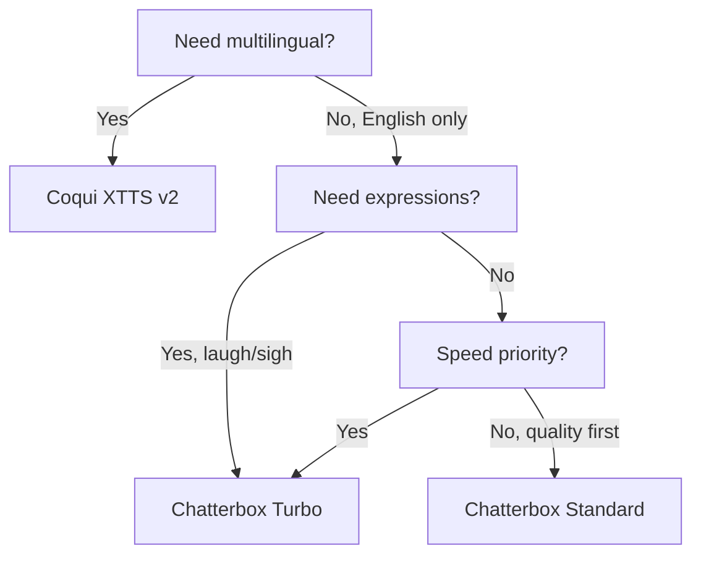

# TTS Engines Guide

VoiceCloner supports multiple TTS engines, each with different strengths. This guide helps you choose the right engine for your use case.

## Engine Comparison

| Feature | Coqui XTTS v2 | Chatterbox Turbo | Chatterbox Standard |
|---------|---------------|------------------|---------------------|
| **Languages** | 16 | English only | English only |
| **Speed** | Medium | Fast | Medium |
| **Quality** | High | Good | High |
| **Model Size** | ~2GB | 350M | 500M |
| **Paralinguistic Tags** | No | Yes | No |
| **Best For** | Multilingual, quality | Fast iteration | Production quality |

## Quick Selection Guide



## Coqui XTTS v2

### Overview

Coqui XTTS v2 is a multilingual TTS model that excels at voice cloning across 16 languages. It's the default engine and the most versatile option.

### Supported Languages

| Code | Language | Code | Language |
|------|----------|------|----------|
| `en` | English | `nl` | Dutch |
| `es` | Spanish | `cs` | Czech |
| `fr` | French | `ar` | Arabic |
| `de` | German | `zh` | Chinese |
| `it` | Italian | `ja` | Japanese |
| `pt` | Portuguese | `hu` | Hungarian |
| `pl` | Polish | `ko` | Korean |
| `tr` | Turkish | `ru` | Russian |

### Parameters

| Parameter | Type | Default | Range | Description |
|-----------|------|---------|-------|-------------|
| `language` | str | `"en"` | See above | Target language |
| `temperature` | float | `0.7` | 0.1-1.0 | Sampling randomness |
| `gpt_cond_len` | int | `128` | 32-256 | GPT conditioning length |

### Temperature Guide

```
0.1-0.3  Conservative - Very consistent, may sound robotic
0.4-0.6  Balanced    - Good consistency with natural variation
0.7-0.8  Natural     - More expressive, slight inconsistency
0.9-1.0  Creative    - Maximum variation, can be unstable
```

### Usage

```python
from voice_cloner import VoiceCloner

# Using constructor
cloner = VoiceCloner(
    speaker_wav="./speaker.wav",
    engine="coqui"
)

# Or factory method
cloner = VoiceCloner.from_coqui(speaker_wav="./speaker.wav")

# Generate in French
cloner.say(
    "Bonjour, comment allez-vous?",
    language="fr",
    temperature=0.7
)
```

### Best Practices

1. **Reference Audio**: 10-30 seconds of clear speech
2. **Temperature**: Start at 0.7, adjust based on results
3. **Long Text**: Break into sentences for consistent quality
4. **Language Match**: Reference and output language can differ

---

## Chatterbox Turbo

### Overview

Chatterbox Turbo (350M parameters) is optimized for speed while maintaining good quality. It's unique in supporting paralinguistic tags for expressive speech.

### Paralinguistic Tags

Insert emotional expressions directly in your text:

| Tag | Effect |
|-----|--------|
| `[laugh]` | Laughter |
| `[chuckle]` | Light laugh |
| `[cough]` | Coughing |
| `[sigh]` | Sighing |
| `[gasp]` | Gasping |
| `[yawn]` | Yawning |

**Example:**
```
"That's hilarious [laugh]! I can't believe it [gasp]!"
```

### Parameters

| Parameter | Type | Default | Range | Description |
|-----------|------|---------|-------|-------------|
| `cfg_weight` | float | `0.5` | 0.0-1.0 | Text adherence weight |
| `exaggeration` | float | `0.5` | 0.0-1.5 | Expressiveness level |

### CFG Weight Guide

Controls how closely the model follows the text:

```
0.0-0.3  Low      - Better for fast speakers, more natural pacing
0.4-0.6  Medium   - Balanced adherence and naturalness
0.7-1.0  High     - Strict text following, may sound forced
```

### Exaggeration Guide

Controls emotional intensity:

```
0.0-0.3  Subtle    - Understated expression
0.4-0.6  Natural   - Normal conversational tone
0.7-1.0  Dramatic  - Strong emotional expression
1.0-1.5  Theatrical - Very exaggerated, use sparingly
```

### Usage

```python
from voice_cloner import VoiceCloner

cloner = VoiceCloner.from_chatterbox(
    speaker_wav="./speaker.wav",
    variant="turbo"
)

# Expressive speech with tags
cloner.say(
    "Oh no [gasp]! That's terrible [sigh]...",
    cfg_weight=0.3,
    exaggeration=0.7
)
```

### Best Practices

1. **Reference Audio**: ~10 seconds is optimal
2. **Fast Speakers**: Lower CFG weight (0.2-0.4)
3. **Tags Placement**: Put tags where expression would naturally occur
4. **Don't Overuse Tags**: One per sentence usually sounds best

---

## Chatterbox Standard

### Overview

Chatterbox Standard (500M parameters) prioritizes quality over speed. Use when the final output quality is critical.

### Parameters

Same as Turbo:

| Parameter | Type | Default | Range | Description |
|-----------|------|---------|-------|-------------|
| `cfg_weight` | float | `0.5` | 0.0-1.0 | Text adherence weight |
| `exaggeration` | float | `0.5` | 0.0-1.5 | Expressiveness level |

**Note**: Paralinguistic tags are NOT supported in Standard variant.

### Usage

```python
from voice_cloner import VoiceCloner

cloner = VoiceCloner.from_chatterbox(
    speaker_wav="./speaker.wav",
    variant="standard"
)

cloner.say(
    "This is high-quality production audio.",
    cfg_weight=0.5,
    exaggeration=0.5
)
```

### Best Practices

1. **Use for Final Output**: Draft with Turbo, finalize with Standard
2. **Clean Reference**: Quality in = quality out
3. **Conservative Settings**: Lower exaggeration for professional content

---

## Engine Selection by Use Case

### Multilingual Content
**Best: Coqui XTTS v2**
- Only option for non-English languages
- Good cross-lingual voice transfer

### Rapid Prototyping
**Best: Chatterbox Turbo**
- Fastest generation time
- Quick iteration on text

### Expressive/Emotional Content
**Best: Chatterbox Turbo**
- Paralinguistic tags for emotion
- High exaggeration for drama

### Professional Voice-Over
**Best: Chatterbox Standard or Coqui**
- Highest quality output
- Most consistent results

### Real-time Applications
**Best: Chatterbox Turbo**
- Lowest latency
- Acceptable quality trade-off

### Audiobook Narration
**Best: Coqui XTTS v2**
- Consistent long-form output
- Good paragraph coherence

---

## Performance Benchmarks

Approximate generation times on different hardware:

| Engine | CPU (i7) | GPU (RTX 3080) |
|--------|----------|----------------|
| Coqui XTTS v2 | 8-15s | 2-4s |
| Chatterbox Turbo | 3-6s | 1-2s |
| Chatterbox Standard | 5-10s | 2-3s |

*Per ~50 word sentence. First run includes model loading.*

---

## Memory Requirements

| Engine | RAM | GPU VRAM |
|--------|-----|----------|
| Coqui XTTS v2 | 8GB+ | 4GB+ |
| Chatterbox Turbo | 6GB+ | 2GB+ |
| Chatterbox Standard | 8GB+ | 3GB+ |

---

## Common Issues

### Coqui

**Problem**: Output doesn't match reference voice
**Solution**: Use longer reference audio (15-30s) or adjust temperature

**Problem**: Pronunciation errors
**Solution**: Spell out unusual words phonetically

### Chatterbox

**Problem**: Tags not working
**Solution**: Ensure using Turbo variant, not Standard

**Problem**: Speech too fast/slow
**Solution**: Adjust CFG weight (lower for fast speakers)

---

## See Also

- [API Reference](api-reference.md) - Detailed parameter documentation
- [Troubleshooting](troubleshooting.md) - Common issues
- [Architecture](architecture.md) - How engines integrate
