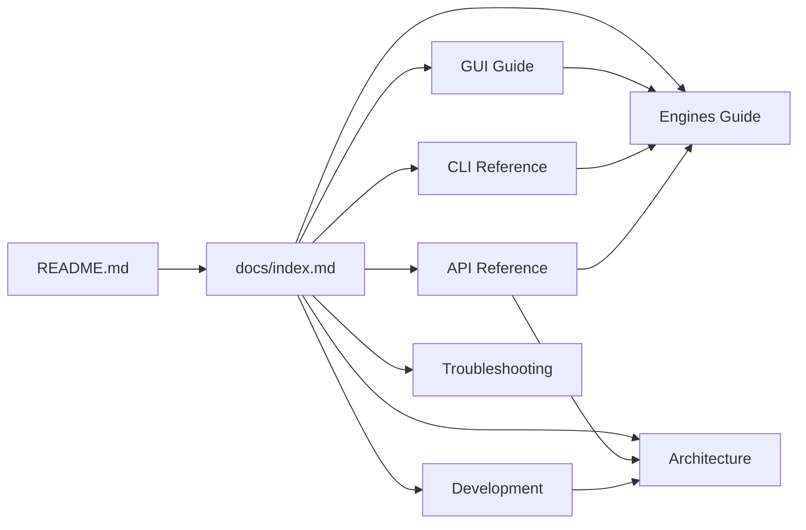

# VoiceCloner Documentation

Welcome to the VoiceCloner documentation. This guide covers everything from basic usage to extending the system with custom TTS engines.

## Getting Started

If you're new to VoiceCloner, start here:

1. **[Quick Start](../README.md)** - Installation and basic usage
2. **[GUI Guide](gui-guide.md)** - Desktop application walkthrough
3. **[Engines Guide](engines.md)** - Choose the right TTS engine

## User Guides

| Guide | Description |
|-------|-------------|
| [GUI Guide](gui-guide.md) | Step-by-step desktop application usage |
| [CLI Reference](cli-reference.md) | Command-line interface documentation |
| [API Reference](api-reference.md) | Complete Python API reference |
| [Engines Guide](engines.md) | TTS engine comparison and parameters |

## Technical Documentation

| Document | Description |
|----------|-------------|
| [Architecture](architecture.md) | System design with diagrams |
| [Development](development.md) | Contributing and extending |
| [Troubleshooting](troubleshooting.md) | Common issues and fixes |

## Quick Links

### By Use Case

- **I want to clone a voice quickly** → [GUI Guide](gui-guide.md)
- **I need to batch process files** → [CLI Reference](cli-reference.md)
- **I'm integrating into my app** → [API Reference](api-reference.md)
- **I want multilingual support** → [Engines Guide](engines.md#coqui-xtts-v2)
- **I need expressive speech** → [Engines Guide](engines.md#chatterbox-turbo)

### By Role

- **End User** → [GUI Guide](gui-guide.md), [Troubleshooting](troubleshooting.md)
- **Developer** → [API Reference](api-reference.md), [Architecture](architecture.md)
- **Contributor** → [Development](development.md), [Architecture](architecture.md)

## Document Map

## Version

This documentation is for VoiceCloner v0.2.0.
